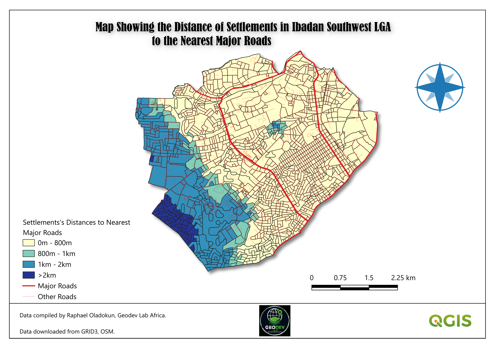

# Spatial analysis

**Week 4 deliverable.** GeoDev Lab Africa, Cohort One.
Author: Raphael Oladokun 

One spatial operation, run on my own data, answering part of my own question.

---

## 1. The operation chosen

**Distance join** (nearest major road to each settlement), not buffer.

The project's stated deliverable is a map shaded by distance to the nearest major road. Buffer only produces a binary inside/outside result at one fixed threshold; it cannot produce a continuous gradient. A distance value per settlement gives the gradient directly, and any threshold-based question (e.g. "more than 2km") can be derived from it afterward as a simple filter, with no extra operation needed.

## 2. Inputs

| Layer | Source | Features | CRS |
|---|---|---|---|
| `settlements_ibadan_southwest` | Clipped GRID3 settlement extents (Week 3) | 1,536 | EPSG:32631 |
| `major_roads_ibadan_southwest` | OSM roads, filtered to `highway` IN (trunk, primary, secondary) | 58 | EPSG:32631 |

Both layers confirmed in a projected CRS (EPSG:32631) before running the operation, per the Week 4 rule: distance in degrees is meaningless.

## 3. What I expected

One output row per settlement (1,536), each carrying a distance value in metres to its nearest major road. Given this is a dense, urbanized LGA, most values expected to be relatively small, with some larger values near the LGA edges.

## 4. Running it

- Tool: `Join attributes by nearest` 
- Input layer: `settlements_ibadan_southwest`
- Input layer 2 (join layer): `major_roads_ibadan_southwest`
- Maximum nearest neighbours: 1
- Maximum distance: none
- Output: `data/processed/settlements_distance_join_raw.gpkg`

## 5. Checking the result — four ways

1. **Map.** Output sat in the correct location, aligned with the input settlements. Pass.
2. **Attribute table row count.** Expected 1,536, got 1,643. **Fail — investigated below.**
3. **One feature by hand.** Picked one settlement, compared its reported distance against a visual estimate to the nearest visible major road on the map. Matched. Pass.
4. **Empty geometry.** Checked — no rows with empty geometry found. Pass.

## 6. The row count problem, and the fix

**Cause:** the settlements layer is stored as Polygon (MultiPolygon). The nearest-join operation processed multipart features part-by-part, producing a separate output row — each with its own distance value — for every part of a settlement that has more than one.

**First check, and why it was wrong:** searched for duplicate values in the `fid` column — found none, which briefly looked like a clean result. `fid` is an auto-generated row identifier assigned fresh to each output row, including split multipart pieces, so checking against it could not have revealed the problem either way.

**Second check, correct this time:** searched for duplicates in `block_id`, a genuine identifier carried over from the original GRID3 settlement data. This correctly surfaced the split rows.

**Fix:** ran `Statistics by Categories` on the joined output, grouping by `block_id`, taking the `min` of the distance column — collapsing any split settlement back into a single row holding its closest (correct) distance. Row count corrected to 1,536.

**Second issue this exposed:** the output of `Statistics by Categories` is a plain attribute table with no geometry — aggregation does not preserve spatial data by default. The corrected `min` distance values were joined back onto the original `settlements_ibadan_southwest` polygons via `block_id`, then exported permanently (not left as a live join) as the final output below.

## 7. Analysis-ready output

- **File:** `data/processed/settlements_distance_final.gpkg`
- **Format:** GeoPackage
- **CRS:** EPSG:32631
- **Features:** 1,536 (one per settlement, geometry preserved)
- **Key field:** minimum distance in metres to nearest major road (from `settlements_distance_summary_min`)

## 8. Result

| Threshold | Settlements exceeding it | % of 1,536 |
|---|---|---|
| > 800 m | 378 | ~24.6% |
| > 1 km | 300 | ~19.5% |
| > 2 km | 96 | ~6.3% |

Full range: 0 m to 2,777 m. Mean approximately 1,390 m.

Three thresholds are reported rather than one. The project's original 2km figure was carried over from an example question in the course materials, not derived from any transport-planning standard; 800m is closer to a commonly cited walkable-access threshold (a 10–15 minute walk). Reporting all three avoids overstating or understating the problem based on which single number was picked.

## 9. Map

`settlements_distance_final` symbolised as Graduated, manual class breaks at 0–800 / 800–1,000 / 1,000–2,000 / 2,000+ metres, matching the thresholds above. Exported as a print layout with map, legend, title, and scale bar.  

---

**Status:** Week 4 complete. See [month-1-summary.md](month-1-summary.md) for the reflective write-up.
